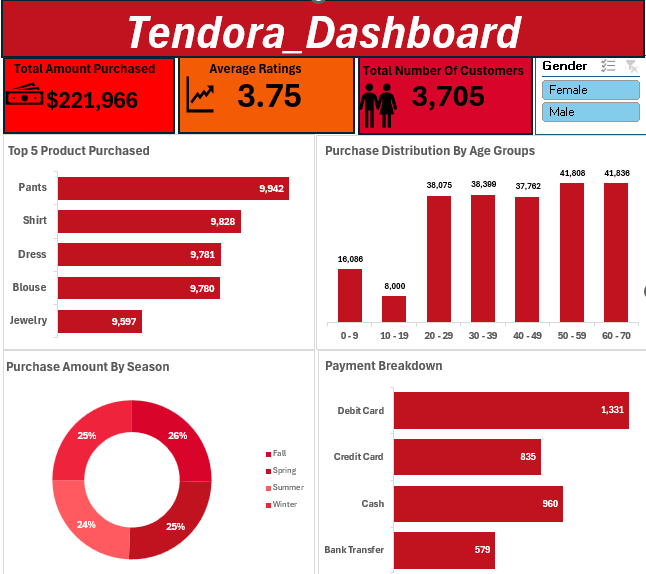

# Trendora Customer Purchase Performance Report
This is an Excel project of Tendora sales dataset. Which provides insights into the customer purchase behaviour and their sales performance.

## Executive Summary
- Trendora’s management lacked a clear, consolidated view of customer purchase behavior across products, demographics, and payment methods. Transaction data existed but was not structured in a way that supported quick insights or data-driven decision-making.

- To address this, an Excel dashboard was developed using cleaned customer purchase data. The dashboard presents key performance indicators (KPIs) and interactive visualizations that summarize revenue performance, customer demographics, product popularity, seasonal trends, and payment preferences.

- The analysis provides visibility into total revenue, customer satisfaction through review ratings, and customer reach through unique customer counts. Key insights include identification of top-selling items, high-spending seasons, dominant age groups, and preferred payment methods. The addition of a Gender slicer allows stakeholders to dynamically explore purchasing behavior across customer segments.

## The Business Problem
- Trendora required a simple but effective reporting solution to better understand its customer purchase data. Existing raw datasets made it difficult to quickly answer key business questions related to customer behavior and sales performance.
- The objective was to move from raw transactional data to an interactive Excel dashboard that could support day-to-day decision-making.

## Key Questions Addressed:

- What is the total revenue generated from customer purchases?

- How satisfied are customers based on review ratings?

- Which products are purchased the most?

- Which age groups and seasons drive the highest purchases?

- How do customers prefer to pay?

## Recommendations
Based on the data analysis, I recommend the following actions for Tendora
- Focus on best-selling products to drive revenue growth.
- Target high-performing age groups with tailored marketing.
- Align inventory and promotions with seasonal demand trends.
- Maintain and optimize popular payment methods.
- Use customer ratings and gender insights to improve personalization and satisfaction.

 ## Links
 [Interactive Excel Dashboard](https://github.com/ajibade-victoria/tendora_data_analysis/raw/refs/heads/main/trendora_shopping_data.xlsx)
 

